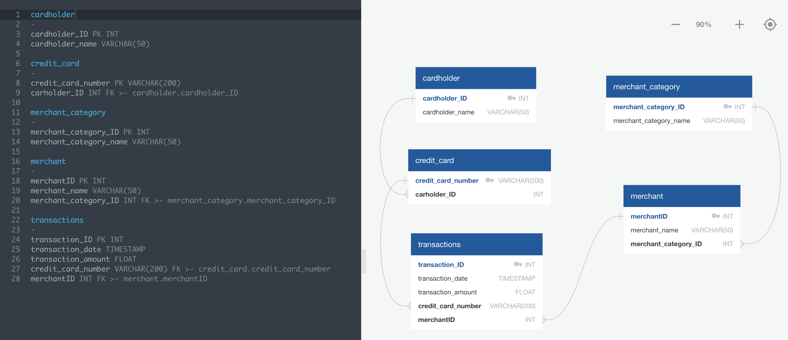
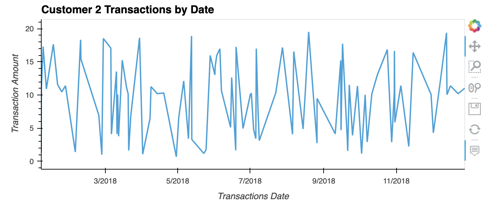
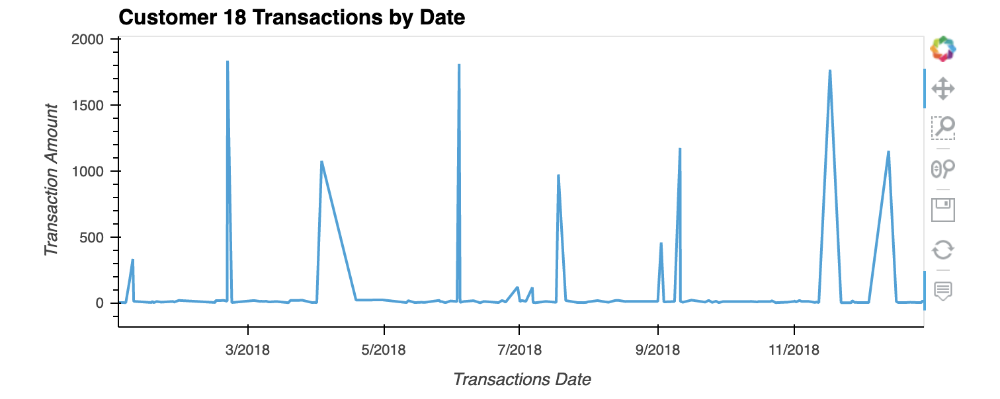
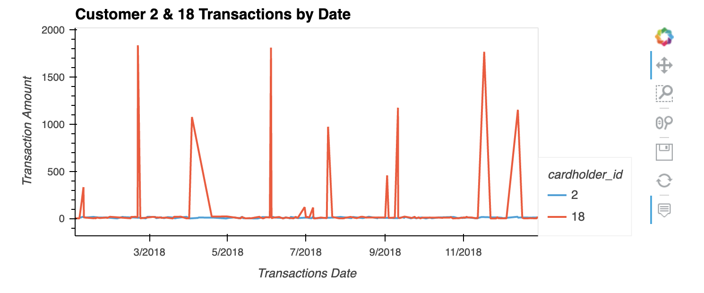
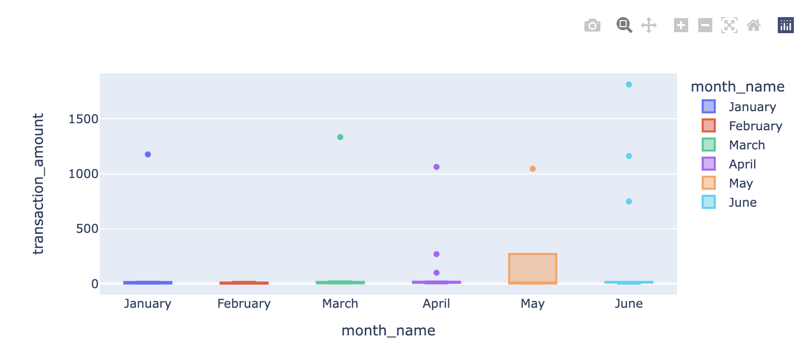

# SQL-Homework

## Homework Goals:
- Create an entity relationship diagram (ERD) to define database model requirements & relationships.
- Create a new database in PostgreSQL and create a schema to populate the database with historic credit card transactions seed data.
- Create SQL queries to analyze the data to identify possible fraudulent transactions, trends data, and develop a report of your observations.

### Entity Relationship Diagram

**Quick DBD Entity Relationship Diagram**

### Data Analysis

#### Part I

1. Some fraudsters hack a credit card by making several small transactions (generally less than $2.00), which are typically ignored by cardholders.
   
    - How can you isolate (or group) the transactions of each cardholder?
        - **Response:** Use INNER JOIN to join the transaction table with the cardholder & merchant tables and sort the dataset by cardholder.  This dataset can be used for future analyses.
   
    - Count the transactions that are less than $2.00 per cardholder:
        - **Response:** A custom query/view was created in the schema to count the transactions less than $2 per cardholder and sort (descending) on cardholders with the most transactions less than $2.
    
    - Is there any evidence to suggest that a credit card has been hacked?
        - **Response:** There are a handful of cardholders (5 total) with over 20 transactions less than $2. However, this data alone is not enough to determine if any cards have been hacked.

2. Take your investigation a step futher by considering the time period in which potentially fraudulent transactions are made.
    
    - What are the top 100 highest transactions made between 7:00 am and 9:00 am?
        - **Response:** A custom query/view was created in the schema to filter on transactions between 7:00 & 9:00 am and sort by the highest amounts. The DATE_PART function was used
    
    - Do you see any anomalous transactions that could be fraudulent?
        - **Response:** The top 5 transactions in this filtered view could be fraudalent.  These transactions are significant in size when compared to the other remaining transactions made in the morning.  Some of these charges were at bars in the morning.
    
    - Is there a higher number of fraudulent transactions made during this time frame versus the rest of the day?
        - **Response:** It appears there are signficantly more high dollar value transactions made throughout the rest of the day.  Therefore, it is more difficult to determine if the transactions throughout the rest of the day are fraudalent.
    
    - If you answered yes to the previous question, explain why you think there might be fraudulent transactions during this time frame.
        - **Response:** It appears easier to identify fraudalent transactions earlier in the day as the dollar value of transactions during this time is typically smaller.  Therefore, high dollar value transactions stand out and could be fraudalent.

3. What are the top 5 merchants prone to being hacked using small transactions?
    - **Response:** The top 3 merchants with total transactions below $2 are: Wood-Ramirez (7), Baker Inc. (6), & Hood-Phillips (6).  There are a number of other merchants beyond the top 3 list with 5 transactions below $2.

#### Part II

1. The two most important customers of the firm may have been hacked. Verify if there are any fraudulent transactions in their history. For privacy reasons, you only know that their cardholder IDs are 2 and 18.
    
    - Using hvPlot, create a line plot representing the time series of transactions over the course of the year for each cardholder separately.

    **Cardholder 2 Transactions**
    

    **Cardholder 18 Transactions**
    

    - Next, to better compare their patterns, create a single line plot that contains both card holders' trend data.

    **Cardholder 2 & 18 Combined Transactions**
    

    - What difference do you observe between the consumption patterns? Does the difference suggest a fraudulent transaction? Explain your rationale.
        - **Response:** It appears that cardholder 18 has a higher likelihood of fraudalent transactions.  This cardholder has anomalous transactions throughout the year.  There are many small transactions with a few scattered very large transactions.  Cardholder 2 has more consistent small transactions that are above $2 with limited larger transactions.

2. The CEO of the biggest customer of the firm suspects that someone has used her corporate credit card without authorization in the first quarter of 2018 to pay quite expensive restaurant bills. Again, for privacy reasons, you know only that the cardholder ID in question is 25.
    
    - Using Plotly Express, create a box plot, representing the expenditure data from January 2018 to June 2018 for cardholder ID 25.

    **Cardholder 25 Monthly Box Plot**
    

    - Are there any outliers for cardholder ID 25? How many outliers are there per month?
        - **Response:** Yes, January (1), March (1), April (3), May (1), & June (3) all have outlier transactions.  The number of outliers are denoted in parenthesis.
    
    - Do you notice any anomalies? Describe your observations and conclusions.
        - **Response:** April and June have the most anomalous transactions.  Also the box plot for May appears wider compared to the other months with a wider distribution/interval.